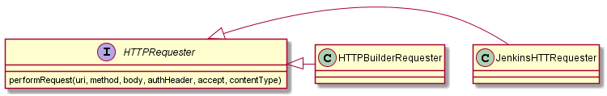

<!-- To update this ToC: markdown-toc --indent "    " -i CONTRIBUTING.md -->

<!-- toc -->

- [Introduction](#introduction)
- [Suggesting new features](#suggesting-new-features)
- [Reporting a bug](#reporting-a-bug)
- [Contributing some code](#contributing-some-code)
    * [PR Checklist](#pr-checklist)
    * [Development environment](#development-environment)
    * [Tests](#tests)
        + [With docker-compose](#with-docker-compose)
    * [Coding style](#coding-style)
    * [Continuous integration](#continuous-integration)
        + [pre-commit hooks](#pre-commit-hooks)
    * [Code reviews](#code-reviews)
    * [Release & upload to Nexus](#release--upload-to-nexus)
- [FAQ](#faq)
    * [HTTPRequester](#httprequester)
    * [Known issues with Jenkins Pipeline](#known-issues-with-jenkins-pipeline)
    * [Other known issues](#other-known-issues)
    * [Debugging Grapes resolution](#debugging-grapes-resolution)
- [Releasing](#releasing)
- [Credits](#credits)

<!-- tocstop -->

# Introduction

First off, thank you for considering contributing to `hesperides-jenkins-lib` !

There are many ways you can help us in this project:
- first, test it and tell us what you think about it !
- help us by **communicating** around the project: present it to your coworkers, and maybe use it in your organization !
- suggest **new features** and/or improvements to existing ones: get a look at the "[suggesting new features](#Suggesting-new-features)" section below detailing how to proceed
- tell us when you face **bugs** by creating a [bug report issue](#reporting-a-bug)
- **contribute some code** to the project, by making a [pull request](#contributing-some-code)

Overall, don't hesitate to get in touch with us throught this project [issues](https://github.com/voyages-sncf-technologies/hesperides-jenkins-lib/issues) for any request,
even for simple questions.

# Suggesting new features

First off, make sure it hasn't been suggested before by making a quick [issues search](https://github.com/voyages-sncf-technologies/hesperides-jenkins-lib/issues).

If not, simply open an issue including the following information:
- a short description of what you have in mind
- **why** you need this feature : this will help us to understand your need and maybe suggest an existing solution or an alternative approach
- as much explanatory documentation as you are willing to add:
  * a simple diagram is often very helpful
  * a [user story](https://en.wikipedia.org/wiki/User_story) or a user-centered usage scenario
  * in case of REST API changes, a [Swagger](https://swagger.io) spec
- finally, whether you are willing to work on a PR to implement it

# Reporting a bug

First off, make sure it hasn't been reported yet by making a quick [issues search](https://github.com/voyages-sncf-technologies/hesperides-jenkins-lib/issues).

If not, please open an issue including the following information:
- the current version of `hesperides-jenkins-lib` you are using
- some **detailed steps to reproduce it** (_e.g._ a `Jekinsfile`)
- please include the Jenkins logs and stack trace whenever possible

# Contributing some code

The overall process is:
1. Make sure there is an issue detailing the feature you want to implement or bug you want to fix.
Ideally, indicate in this issue that you intend to work on it to begin with.
2. [Fork this repository](https://help.github.com/articles/fork-a-repo/) under your GitHub username,
and install your [development environment](#development-environment).
3. Write some code !
4. Commit and push your changes on your forked repo, ideally on a specific branch and not on `master` (to allow you to work on different issues in parallel).
During this step, the [continuous integration](#continuous-integration) checks will be executed to detect issues before your code is merged.
5. [Create a pull request](https://help.github.com/articles/creating-a-pull-request/), and make sure the [Travis CI & Circle CI](#continuous-integration) builds pass.
Then mention in the related issue that you created this PR, and ask for a [code review](#code-review).
6. It is very likely you will be asked to make some minor changes: simply add commits in your branch on your forked repo,
they will be automatically taken into account in the pull request, and then [squashed](https://help.github.com/articles/about-pull-request-merges/#squash-and-merge-your-pull-request-commits) by GitHub when merged.

Once you've fixed all the potential issues, a maintainer of this project will merge your contribution.

That's it !

## PR Checklist

There is the list of things to include in your PRs,
and that reviewers will check:

- the code uses the idioms already present in the code: `required` arguments, `httpRequest` method used for HTTP calls, public API up-to-date in `vars/hesperides.groovy`, etc.
- you ran the linter (_cf._ [Coding style](#coding-style))
- the existing non-regression tests pass (_cf._ [Continuous integration](#continuous-integration))
- you added **new tests**
- the documentation has been updated: code snippet `Jenkinsfile`, detailed doc in `vars/hesperides.txt`, `CHANGELOG.md` & `CONTRIBUTORS.md` updated

## Development environment

You will need Docker & `docker-compose`. A local Groovy & Gradle installation may also help you to run things (linter, tests) more easily.

## Tests

The tests require the `$HESPERIDES_HOST` environment variable to be set, including the protocol.
An optional `$HESPERIDES_PORT` can also be specified,
along with `$HESPERIDES_AUTH` as `<USERNAME>:<PASSWORD>`.

    gradle test

To run a single test:

    gradle -Dtest.single=HesperidesIntegrationSpec test

⚠️ **WARNING**: Integration tests perform modifications on the target Hesperides instance

The test report is generated in `build/reports/tests/test/index.html`.

### With docker-compose

Integration tests use a dockerized Hesperides instance.

    docker-compose build
    docker-compose run gradle-check

To expose the `build/` directory generated, containing the tests reports:

    docker-compose run --volume ./build:/home/gradle/build gradle-check

If you want to only use Docker to launch an Hesperides instance:

    docker-compose up -d hesperides
    HESPERIDES_HOST=http://localhost
    HESPERIDES_PORT=8080
    gradle test

## Coding style

Currently, we do not enforce any code style, but we strongly encourage you to execute the CodeNarc Groovy linter:

    gradle check

In general:

- follow [Robert C. Martin "Clean Code" recommendations](https://image.slidesharecdn.com/cleancode-vortrag-03-2009-pdf-121006112415-phpapp02/95/clean-code-pdf-version-16-728.jpg?cb=1349523162).
- we avoid methods with too many parameters, we use named-parameter with `Map args`, and validate necesseray parameters with `required`.
- do NOT `@Grab` in source files under `src/`, it makes the code non-testable

## Continuous integration

Two online services are configured on this project to automatically execute tests on every commit on each each commit or pull request:

- [Circle CI](https://circleci.com/gh/voyages-sncf-technologies/hesperides-jenkins-lib) will run Gradle integration tests with a running Docker instance of Hesperides,
_cf._ [.circleci\config.yml](.circleci\config.yml)
- [Travis CI](https://travis-ci.org/voyages-sncf-technologies/hesperides-jenkins-lib) will run some static analysis checks,
_cf._ [.travis.yml](.travis.yml) and the next section

### pre-commit hooks

In order to execute a number of checks before each commit, this project uses `git` [pre-commit](http://pre-commit.com) hooks.
They are listed in the [.pre-commit-config.yaml](.pre-commit-config.yaml) configuration file.

As much as possible, please try to install them on your development machine.
If you can't or don't want to, you'll have to use the Travis CI build logs to debug issues that may arise with them.

To install them on your development machine, you will need Python, and the `pre-commit` package that can be installed with `pip`.
To configure `git` to run them before each commit, execute the following command:

    pre-commit install

You can also run those hooks manually:

    pre-commit run $hook_name             # execute a single hook on all modified files
    pre-commit run --files $file1 $file2  # execute all hooks on some selected files
    pre-commit run --all-files            # execute all hooks on all files

## Code reviews

Every pull request must be reviewed by a current maintainer of the project, and get their approval.

Code reviewers should follow the [PR Checklist](#pr-checklist) and those guidelines:
- [yelp guidelines](https://engineeringblog.yelp.com/2017/11/code-review-guidelines.html)
- [Sebastien Charrier advices](https://www.youtube.com/watch?v=6aQK6GoTbxM)

## Release & upload to Nexus

1. `git tag` & `git push --tags`
2. modifify the `build.gradle` according to this tag
3. set the `NEXUS_URL` / `NEXUS_USER` / `NEXUS_PASSWORD` environment variables
4. `gradle upload`

# FAQ

## HTTPRequester

Because we want this library to be usable both with the standard Groovy interpreter and the jenkins groovy-cps plugin,
we faced the challenge of making HTTP requests in both contexts:

- in Jenkins pipelines, the recommended solution is to use the non-builtin [http_request](https://jenkins.io/doc/pipeline/steps/http_request/) plugin.
Another, more hacky approach, would be to use the [sh step](https://jenkins.io/doc/pipeline/steps/workflow-durable-task-step/#code-sh-code-shell-script) + `curl`.

- with the Groovy standard interpreter, [groovyx.net.http.HTTPBuilder](https://github.com/jgritman/httpbuilder/wiki) is a very common library to make HTTP calls

**Both are based on [org.apache.httpcomponents.httpclient](https://hc.apache.org/httpcomponents-client-ga/index.html)**.

In order to use either one dependeing on the execution context, we created the `com.vsct.dt.hesperides.jenkins.pipelines.http` package to abstract this into an `HTTPRequester` interface:

<!-- To generate the .png from the .txt file with PlantUML:
java -jar plantuml.jar -tpng HTTPRequester.txt
-->

## Known issues with Jenkins Pipeline

:bangbang: ⚠️ You may or may not be impacted by the issues in this list, depending on the Jenkins version you use  :bangbang:

- `abstract` classes & `traits` do not work : cf. https://issues.jenkins-ci.org/browse/JENKINS-39329 & https://issues.jenkins-ci.org/browse/JENKINS-46145
- static nested classes limitations : https://issues.jenkins-ci.org/browse/JENKINS-41896
- use `JsonSlurperClassic` instead of `JsonSlurper` : http://stackoverflow.com/a/38439681/636849
- assignment in `if` statements : https://issues.jenkins-ci.org/browse/JENKINS-41422
- `.empty` is buggy, always uses `.isEmpty`: https://issues.jenkins-ci.org/browse/JENKINS-50863
- `List.sort()` does not work properly with a `Closure` parameter : it does not return a list and will not sort it. _cf._https://issues.jenkins-ci.org/browse/JENKINS-44924 & https://wiki.jenkins.io/display/JENKINS/Pipeline+CPS+method+mismatches

Some of those "code smells" are detected by `git` _pre-commit_ hooks defined in [.pre-commit-config.yaml](.pre-commit-config.yaml).

## Other known issues

`javax.net.ssl.SSLException: java.lang.RuntimeException: Could not generate DH keypair` exception when using [http_request](https://wiki.jenkins-ci.org/display/JENKINS/HTTP+Request+Plugin) plugin : you need to run Jenkins with Java 8, a bug with Java 7 will prevent you from making HTTPS requests.

cf. http://vboard.vsct.fr/vblog/?p=561

## Debugging Grapes resolution

Deleting an artifact in both Groovy & Maven caches, to test re-downloading (yes, Groovy will use Maven cache by default !) :

    rm -r %HOME%\.groovy\grapes\com.cloudbees\groovy-cps %HOME%\.m2\repository\com\cloudbees\groovy-cps

Rerunning a script with increased logging:

    set CLASSPATH=src
    groovy -Dgroovy.grape.report.downloads=true -Divy.message.logger.level=3 vars/getHesperidesPlatformInfo.groovy --app CSC --platform USN1

Look for strings like "downloading https://jcenter.bintray.com/com/cloudbees/groovy-cps/1.12/groovy-cps-1.12.jar".

To disable default groovy resolvers (like jcenter), you need to create a [`~/.groovy/grapeConfig.xml`](http://docs.groovy-lang.org/latest/html/documentation/grape.html#Grape-CustomizeIvysettings) file based on [the default one](https://github.com/apache/groovy/blob/master/src/resources/groovy/grape/defaultGrapeConfig.xml), then remove the resolver entries you don't want.

# Releasing
1. complete `CHANGELOG.md`
2. if new methods have been added, ensure a piece of doc exists for them in `vars.hesperides.txt`
3. edit `pom.version` in `build.gradle`
4. `git commit` & `git tag`

# Credits

- First off, thanks to all the past [contributors](CONTRIBUTORS.md) !
- Thanks to Github [opensource.guide](https://opensource.guide) for their guidance on how to write this file,
and also for the top image, used under the [CC-BY-4.0](https://creativecommons.org/licenses/by/4.0/) license.
